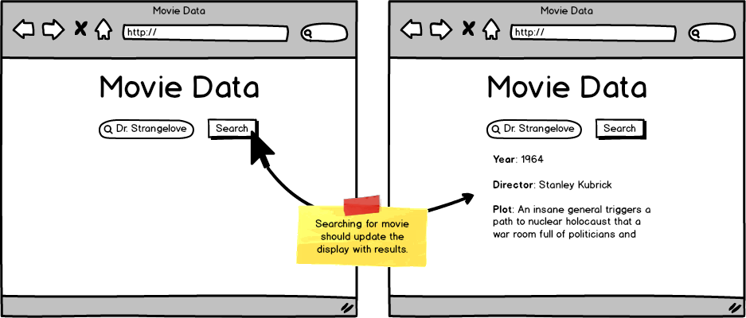

Build an application that allows a user to search by movie title.

Implement client-side validations to protect the user from bad requests, such as blank title, and use the external API [The Open Movie Database](http://www.omdbapi.com/ "OMDb API - The Open Movie Database")

