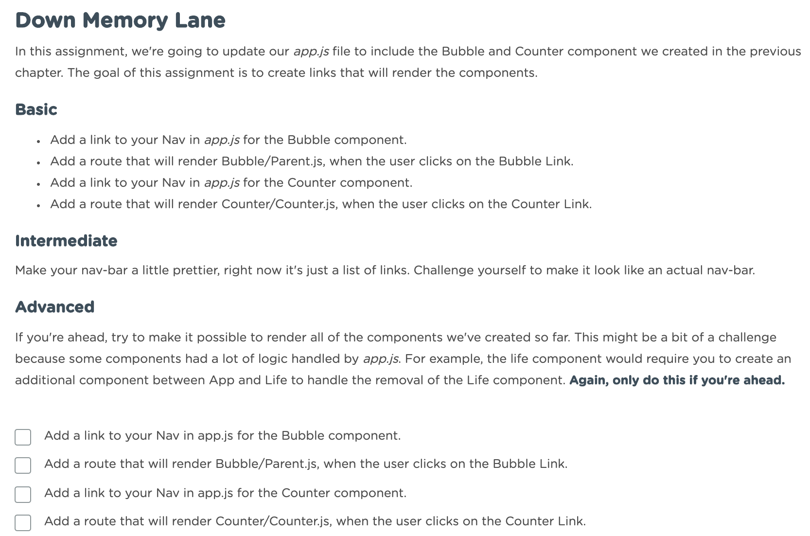

# Down Memory Lane

In this assignment we're going to update and consolidate previous apps we've made. We will refactor the `ToDo` and `Counter` components we created in the previous chapter into one app. The goal of this assignment is to create links that will render those two components.

## Basic

* Add a link to your Nav in app.js for the ToDo component.
* Add a route that will render the ToDo component when the user clicks on a ToDo link.
* Add a link to your nav in app fot the counter component. Add a route that will render the counter when the user clicks on the counter link.

## Intermediate

Make your nav-bar tittle prettier. Right now it's just a list of links. Chalange yourelf to make it look like an actual nav-bar.

## Advanced

If you're ahead, try to make it possible to render all of the components we've created so far. This might be a bit of a chalange because some components had a lot od loggic handeld by app.js. For example, the life component would require you to create an additional component between App and LIfe to handle the removal of the Life component. **Again, only do this if you are ahead.**

