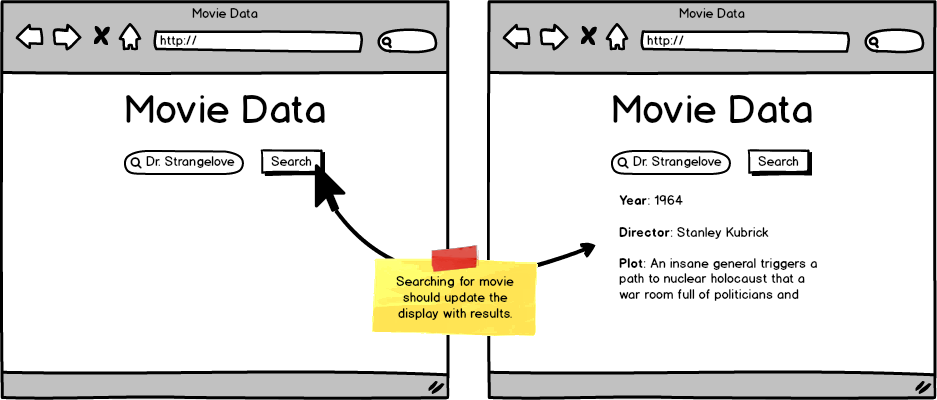

Build an application that allows a user to search by movie title.

* [Movie Data | Tooling & APIs](http://learn.codingdojo.com/m/19/4885/33014)

Implement client-side validations to protect the user from bad requests, such as blank title, and use the external API [The Open Movie Database](http://www.omdbapi.com/ "OMDb API - The Open Movie Database")

### MockAPI

https://5c99df5a1a4c360014a0ffc1.mockapi.io/bootcamp/searchs

