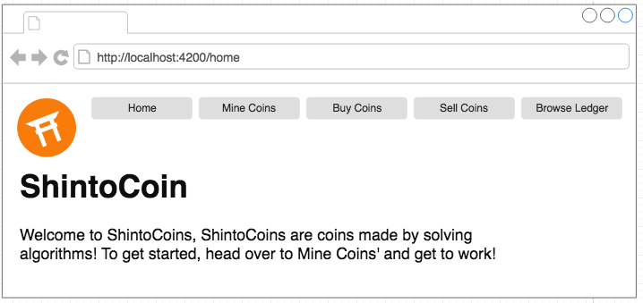

Create your very own ShintoCoin website, where guests can gain new coins, buy, sell and view the transaction history of ShintoCoins.

Useful questions:

* How will you pass the data from component to component?
* Is there any way to leverage how you architect your application to make this easier?
* Could you build special components to help with the issue?

### Useful links:

[Higher Order Components](https://reactjs.org/docs/higher-order-components.html)
[Routing w/ Higher Order Components](http://engineering.blogfoster.com/higher-order-components-theory-and-practice/)

