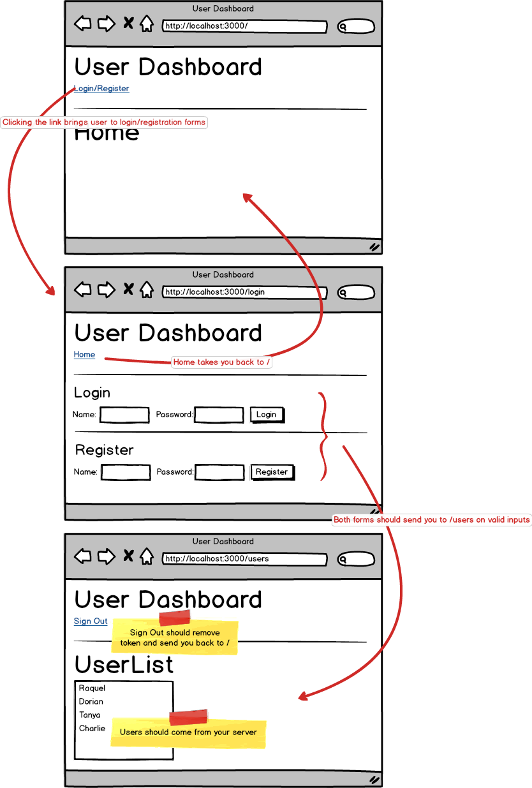

This is one of the most important assignments you'll complete, as it pulls together:

* Node API server
* JWTs
* Client-side routing

Build a simple **User Dashboard** application that does the following:

Users should only be able to access the `/users` route when authenticated by the server with a JSON web token.

## Additional resources

* [Front-end route protection](https://reacttraining.com/react-router/web/example/auth-workflow)
* [React Auth Tutorial](https://auth0.com/blog/react-tutorial-building-and-securing-your-first-app/)

That's about it! We'll really put this concept to the test in our next assignment.
