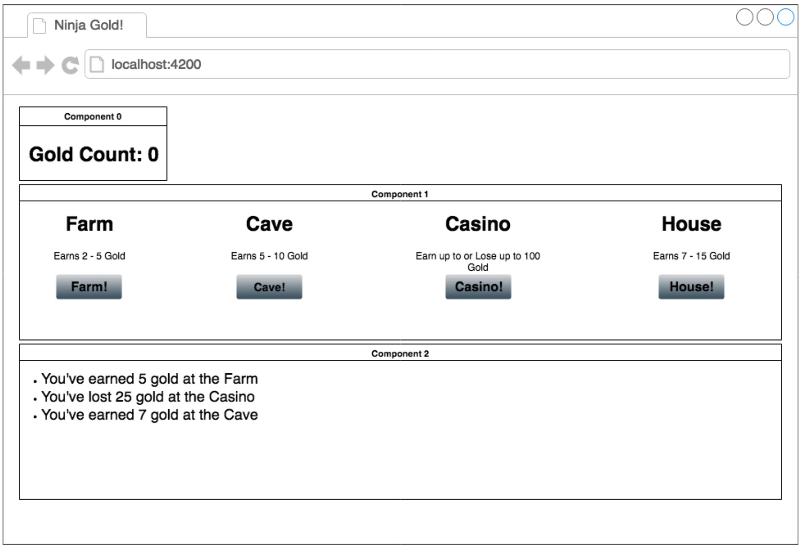

# Ninja Gold

* [This](https://github.com/atanamhaos/react-bootcamp-2019-haos_store/tree/master/bootcamp/week5/Ninja_Gold)

Create This:



Required:
App utilizes API Calls for ...

* Handling Async calls prior to actions and reducers (in the component, just before dispatching an action with the results of the api call) -[link](https://github.com/reduxjs/redux/issues/291)

* Sample helper file

```
import axios from 'axios';
import { updateTasksList } from './redux';

// v2 
export const retrieveTasksPromise = () => {
    return axios.get(`http://5c992ab94236560014393239.mockapi.io/tasks`);
}

export const updateTasksPromise = (id, task) => {
    return axios.put(`http://5c992ab94236560014393239.mockapi.io/tasks/${id}`, task);
}
```

* Sample mapDispatchToProps

```
// v2 -- helper file needed...
const mapDispatchToProps = (dispatch) => ({
  retrieveTasksFromServer: () => retrieveTasksPromise().then( (response) => dispatch(updateTasksList(response.data))),
  viewProfile: (id) => dispatch(viewProfile(id))
})
```

* Code to trigger prop to initialize state from component loading (e.g. app component, or a root level component that loads 1 time initially.

```
componentDidMount() {
    this.props.retrieveTasksFromServer();
  }
```