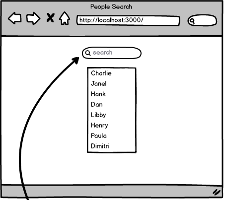

# People Search

* [People Search | react-bootcamp-2019-haos_store](https://atanamhaos.github.io/react-bootcamp-2019-haos_store/bootcamp/week5/People_Search/)

Using the `redux` library, build the following application. You'll also want the `react-redux` dependency:

* Initially, all names are shown below search field.
* Names are clickable and change the display to show details of the name clicked.

* Typing dynamically refines/filters the names shown to only include names that include the string typed.

* Details shown include `city`, `industry`, `hobbies`, and `email`.
* A back button returns user to the search feature.